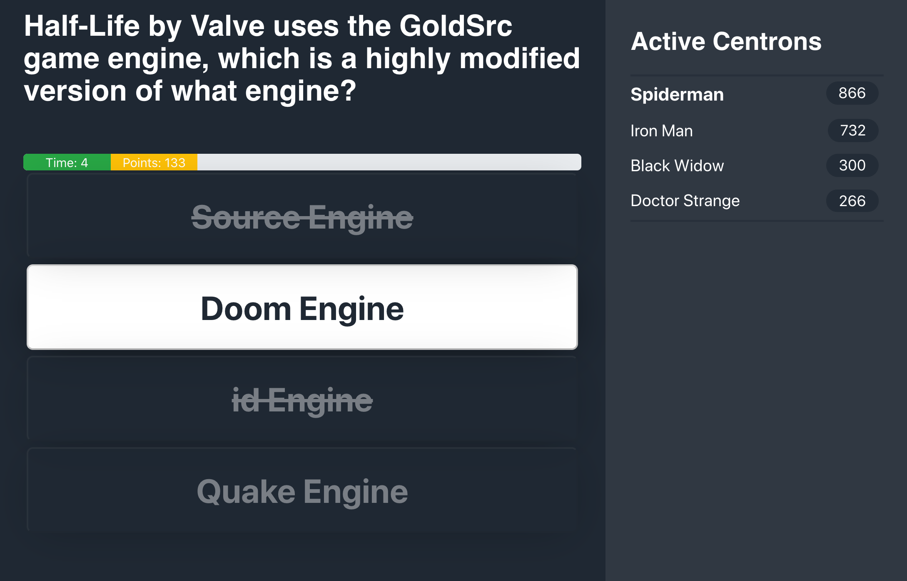
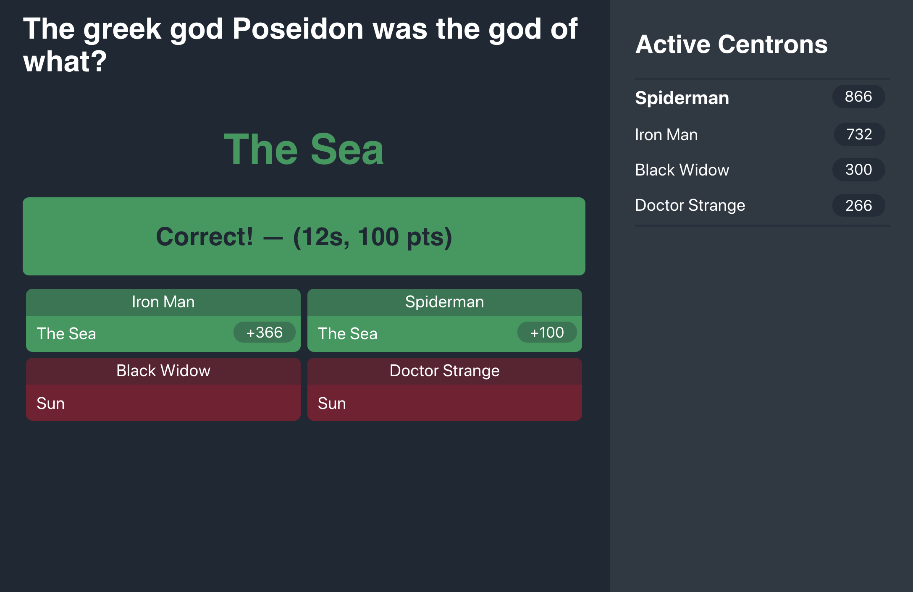
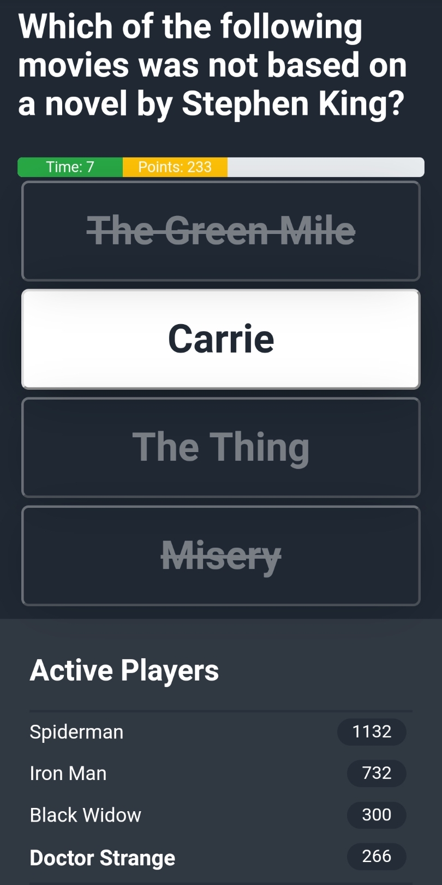
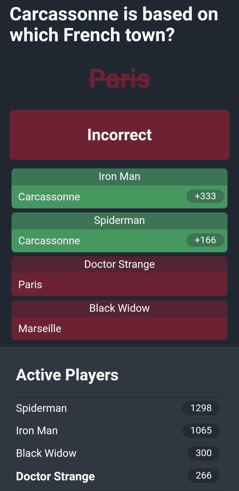

# gshow

GShow (GameShow) is a multiple choice trivia game. Multiple players can connect via a web browser on a computer or phone
to compete. Players are awarded more points for answering sooner and are not penalized for incorrect answers.

The game supports OpenTriviaDB JSON format and a custom format with more features. One such feature is image support in 
questions, although currently images have to live on the host domain.

The game is built in Java on the backend and React on the front end. Currently the game only supports a single server as
sessions are managed in server memory. Spring is used on the Java backend and both ServerSentEvents or polling is 
possible. This can be configured through the `server.config.sse` application property. Server sent events doesn't work
on every server (not supported on GCloud).









## Installation

Prerequisites:
- Java9 JDK or higher
- Gradle
- NPM

Get the code:
```
git clone https://github.com/hoyley/gshow.git
cd gshow
```

### Local Setup

Build the client:
```
cd app
npm install
```

Build the server (in the root directory):
``` 
gradle build
```

Run the server:
```
gradle bootRun
```

Navigate to `localhost:8080` to open the client in the browser. Do not use `npm start` and `localhost:3000` or Server 
Sent Events will not work!


### Docker Setup
After you've built the client and the server, you can build a docker image using:
```
docker-compose build
```


